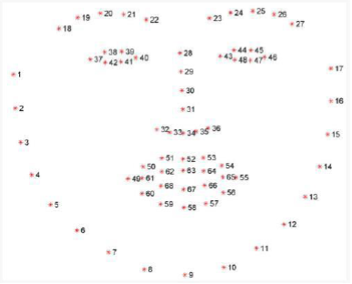
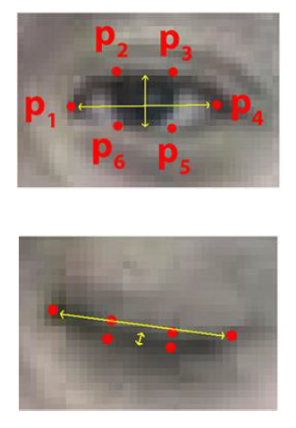

# ***Drowsiness Detection***
 
`INTRO` : This project captures images continuously and measures the state of the eye(sleepy or not) according to the specified algorithm and gives warning after a defined time.

- `Language Used` :
	- [Python 3](https://www.python.org/doc/)

- `IDE or Tool Used` :
    - Jupyter Notebook

- `Libraries Used` :
    - [numpy](https://numpy.org/)
    - [dlib](https://pypi.org/project/dlib/)
    - [openCV](https://pypi.org/project/opencv-python/)
    - [math](https://docs.python.org/3/library/math.html)
    - [os](https://docs.python.org/3/library/os.html)
    
## About this project : 
Real Time Drowsiness behaviors which are related to fatigue are in the form of eye closing, head nodding or the brain activity. Hence, we can either measure change in physiological signals, such as brain waves, heart rate and eye blinking to monitor drowsiness or consider physical changes such as sagging posture, leaning of driver’s head and open/closed state of eyes.

***Eye Detection***  
In this, I have used facial landmark prediction for eye detection. `Facial landmarks` are used to localize and represent salient regions of the face, such as: Eyes, Eyebrows, Nose, Mouth and Jawline.

Facial landmarks have been successfully applied to face alignment, head pose estimation, face swapping, blink detection and much more. In the context of facial landmarks, our goal is detecting important facial structures on the face using shape prediction methods.

Detecting facial landmarks is therefore a two step process:  
   - Localize the face in the image.
   - Detect the key facial structures on the face.
	
This method starts by using:  
   1. A training set of labeled facial landmarks on an image. These images are manually labeled, specifying specific (x, y)-coordinates of regions surrounding each facial structure.
   2. Priors, of more specifically, the probability on distance between pairs of input pixels.

The pre-trained facial landmark detector inside the dlib library is used to estimate the
location of 68 (x, y)-coordinates that map to facial structures on the face. We can detect
and access both the eye region by the following facial landmark index show below :  
    • The right eye using [36, 42]  
    • The left eye with [42, 48]  
  
  
  
***Recognition of eye's state***  
The eye area can be estimated from optical flow, by sparse tracking or by frame-to-frame intensity differencing and adaptive thresholding. And finally, a decision is made whether the eyes are or are not covered by eyelids. A different approach is to infer the state of the eye opening from a single image, as e.g. by correlation matching with open and closed eye templates, a heuristic horizontal or vertical image intensity projection over the eye region, a parametric model fitting to find the eyelids, or active shape models.   

A major drawback of the previous approaches is that they usually implicitly impose too strong requirements on the setup, in the sense of a relative face-camera pose (head orientation), image resolution, illumination, motion dynamics, etc. Especially the heuristic methods that use raw image intensity are likely to be very sensitive despite their real-time performance.    

Therefore, we propose a simple but efficient algorithm to detect eye blinks by using a recent facial landmark detector. A single scalar quantity that reflects a level of the eye opening is derived from the landmarks. Finally, having a per-frame sequence of the eyeopening estimates, the eye blinks are found by an SVM classifier that is trained on examples of blinking and non-blinking patterns.

***Eye Aspected Ratio Calculation***  
For every video frame, the eye landmarks are detected. The eye aspect ratio (EAR) between height and width of the eye is computed.  

        EAR = ||p2 − p6|| + ||p3 − p5| / 2||p1 − p4||  

where p1, . . ., p6 are the 2D landmark locations.   
  
The EAR is mostly constant when an eye is open and is getting close to zero while closing an eye. It is partially person and head pose insensitive.  
Aspect ratio of the open eye has a small variance among individuals, and it is fully invariant to a uniform scaling of the image and in-plane rotation of the face. Since eye blinking is performed by both eyes synchronously, the EAR of both eyes is averaged. This interface helps the user to adjust the EAR accordingly ranging from low to high percent. It also allows the user to set the timer sensitivity.

  
***Eye State Determination***
Finally, the decision for the eye state is made based on EAR calculated in the previous step. If the distance is zero or is close to zero, the eye state is classified as “closed” otherwise the eye state is identified as “open”.

***Drowsiness Detection***  
The last step of the algorithm is to determine the person’s condition based on a pre-set condition for drowsiness. The average blink duration of a person is 100-400 milliseconds (i.e. 0.1-0.4 of a second).  
   
Hence if a person is drowsy his eye closure must be beyond this interval. We set a time frame of 5 seconds. If the eyes remain closed for five or more seconds, drowsiness is detected and alert pop regarding this is triggered.

###### THE END